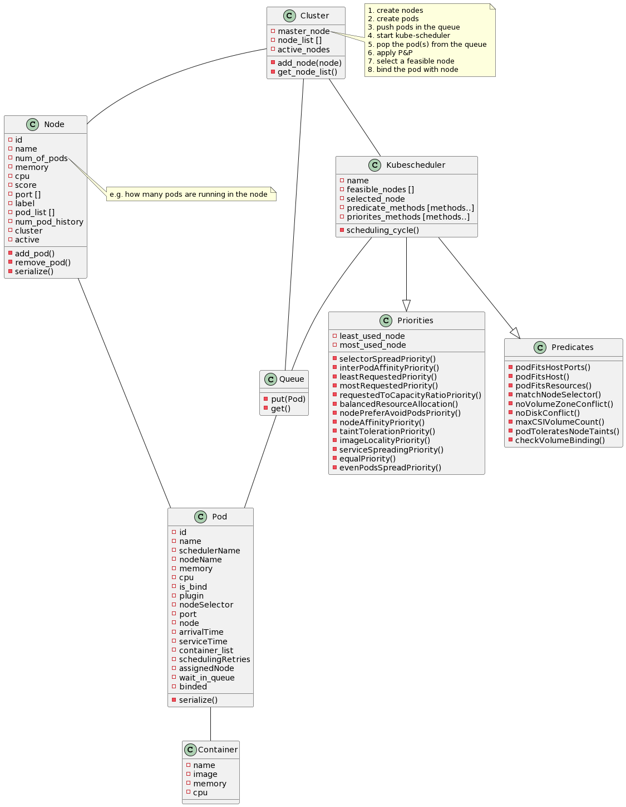

# Ksimul8 - Kubernetes Scheduler Simulator

This is the source code of a simulation application for the kubernetes default scheduler "kubescheduler", created using python simulation package 'simpy'.

A thesis project of *University of Pisa* and *CNR-ISTI*.

## Team

### Supervisor

|Name and Surname            | Email                       |
|----------------------------|-----------------------------|
|Dr. Patrizio Dazzi, Ph.D.   |patrizio.dazzi@isti.cnr.it   |
|Dr. Emanuele Carlini, Ph.D. |emanuele.carlini@isti.cnr.it |

### Student Details

|Name and Surname  | Email                         |
|------------------|-------------------------------|
|Usman Shahzad     |u.shahzad1@studenti.unipi.it   |

<!-- ## Architecture

 -->

## Instructions

### Initialization

To setup the project initially you have to run these commands
inside the project's root.

    python3 -m venv venv

    source venv/bin/activate

    pip install -r requirements.txt

### Input Files

Before running the application we need to provide the following input files:

- Pod deployment file(s) (YAML) in the **pods** directory, or
- A CSV file containing a list of jobs. As an example, we used the data obtained from Alibaba dataset <https://github.com/alibaba/clusterdata/blob/master/cluster-trace-microservices-v2021/README.md>
- Input file (YAML) in the **src** directory

Some of the files are already provided for demo purpose.

### Plugins

The input file contains a parameter (*plugin*) which is used to assign a custom plugin for each pod. A plugin is basically a combination of predicates and priorites which are used by the Kubescheduler to execute a scheduling cycle.

For example: `plugin: '0110000000010000001000'`

It is a **22 bit** string, where **1 = ON** and **0 = OFF** for the following order of the predicates and the priorites:

|Predicates                | Priorites                          |
|--------------------------|------------------------------------|
|1. PodFitsHostPorts       |10. SelectorSpreadPriority          |
|2. PodFitsHost            |11. InterPodAffinityPriority        |
|3. PodFitsResources       |12. LeastRequestedPriority          |
|4. MatchNodeSelector      |13. MostRequestedPriority           |
|5. NoVolumeZoneConflict   |14. RequestedToCapacityRatioPriority|
|6. noDiskConflict         |15. BalancedResourceAllocation      |
|7. MaxCSIVolumeCount      |16. NodePreferAvoidPodsPriority     |
|8. PodToleratesNodeTaints |17. NodeAffinityPriority            |
|9. CheckVolumeBinding     |18. TaintTolerationPriority         |
|                          |19. ImageLocalityPriority           |
|                          |20. ServiceSpreadingPriority        |
|                          |21. EqualPriority                   |
|                          |22. EvenPodsSpreadPriority          |

### Run the Project

To run the project execute the following command:

    bash run.sh
